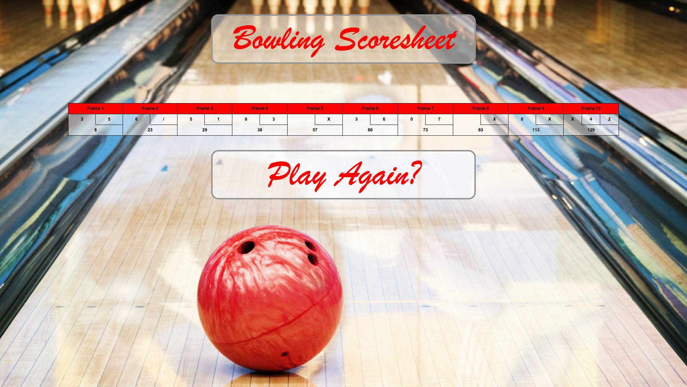

[](https://travis-ci.org/andygout/bowling-challenge)


Bowling Challenge
=================


Challenge:
-------

Count and sum the scores of a bowling game for one player (reminder of the rules at foot of README)


Technologies Used:
-------

- Javascript (language) with jQuery (Javascript library)
- Tested using Jasmine (behavior-driven development framework for testing JavaScript code)
- Deployed to Heroku as static site using Rack gem


Setup
-------

- Run site on local server: `$ open public/index.html`
- Run Jasmine tests: `$ open public/SpecRunner.html`


User stories:
-------

```
As a bowler
So that I can keep track of my score during a bowling game
I want to be able to log my scores on a scoresheet

As a foolish bowler
So that I don't accidentally enter an incorrect score
I want only the remaining possible number of pins to be displayed in the selection

As an pedantic bowler
So that my strikes (X) and spares (/) are displayed in the correct form
I want those to be displayed on the scorecard rather than numbers

As a competitive bowler
So that I have an accurate score throughout
I want to see the total of a frame only once strike and spare bonuses have been added

As an addicted bowler
So that upon finishing a game I can start a new one
I want to be presented with that option
```


Learning
-------

The logic of the strikes and spares is very complex, especially in terms of the final score for a specific frame not being available until a further one or possibly two frames are played (complicated further by the final frame). The logic had to be made as granular as possible and so I tried to atomise the larger methods into smaller, more descriptive ones, as it was very easy to fall victim to a God method with numerous if/else statements that controlled the entire game logic. Attempting the challenge again I would write separate `frame` and `final_frame` files to fully separate those sets of logic given they are so different.

I felt a substantial number of tests were necessary given the numerous variant outcomes and so I tried to cover these as comprehensively as possible.

I enjoyed playing around with jQuery and the immediate responsiveness of a single page application (SPA) was very gratifying.

Deploying a static site to Heroku nevertheless required a server; Rack was used (installed as gem `gem 'rack'`), with `config.ru` instructing it to serve the site as static ([Heroku Dev Center: Creating Static Sites in Ruby with Rack](https://devcenter.heroku.com/articles/static-sites-ruby))


Next Steps
-------

- UI testing with [Jasmine-jQuery](https://github.com/velesin/jasmine-jquery)


Live demo on Heroku:
-------
[Bowling Scorecard](https://dry-harbor-7560.herokuapp.com/)


Links:
-------

[Makers Academy: Bowling Challenge brief](https://github.com/makersacademy/bowling-challenge)

[Bowling Genius (useful guide to scoring logic)](http://www.bowlinggenius.com/)


Images:
-------

- Sign up


- Sign up errors



The Rules of Ten Pin Bowling:
-------

A bowling game consists of 10 frames in which the player tries to knock down the 10 pins. In every frame the player can roll one or two times. The actual number depends on strikes and spares. The score of a frame is the number of knocked down pins plus bonuses for strikes and spares. After every frame the 10 pins are reset.


Strikes
-------

The player has a strike if he knocks down all 10 pins with the first roll in a frame. The frame ends immediately (since there are no pins left for a second roll). The bonus for that frame is the number of pins knocked down by the next two rolls. That would be the next frame, unless the player rolls another strike.


Spares
-------

The player has a spare if the knocks down all 10 pins with the two rolls of a frame. The bonus for that frame is the number of pins knocked down by the next roll (first roll of next frame).


10th frame
-------

If the player rolls a strike or spare in the 10th frame they can roll the additional balls for the bonus. But they can never roll more than 3 balls in the 10th frame. The additional rolls only count for the bonus not for the regular frame count.

    10, 10, 10 in the 10th frame gives 30 points (10 points for the regular first strike and 20 points for the bonus).
    1, 9, 10 in the 10th frame gives 20 points (10 points for the regular spare and 10 points for the bonus).


Gutter Game
-------

A Gutter Game is when the player never hits a pin (20 zero scores).


Perfect Game
-------

A Perfect Game is when the player rolls 12 strikes (10 regular strikes and 2 strikes for the bonus in the 10th frame). The Perfect Game scores 300 points.

In the image below you can find some score examples.

More about ten pin bowling here: http://en.wikipedia.org/wiki/Ten-pin_bowling


